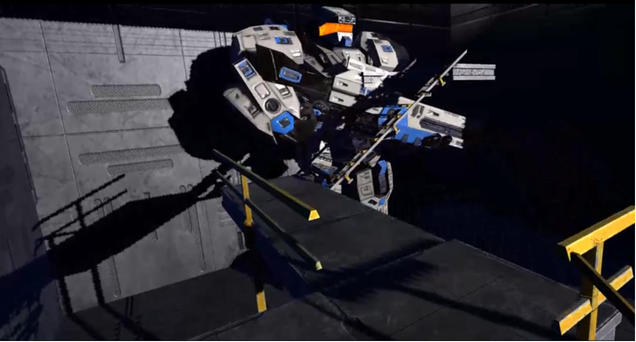
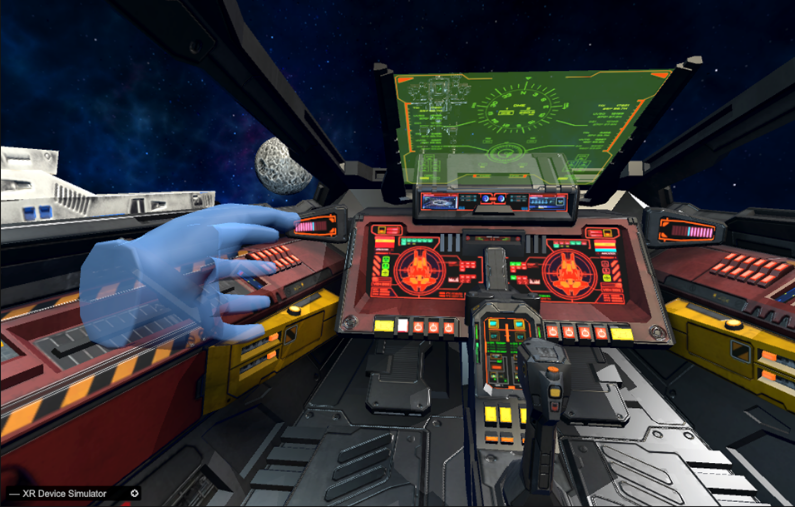

# 2070: Doomsday

VR 조종석에서 장치를 켜고, 조이스틱으로 기체를 움직이며 레이저를 사용하는 Unity 프로젝트입니다. 시작 공간에서 조종석으로 들어간 뒤 조작과 전투 연출을 체험하는 프로토타입으로 만들었습니다.

## 게임 화면

**시작 공간** — 메카가 배치된 공간을 지나 조종석 씬으로 이동합니다.

**VR 조종석** — 조이스틱과 콘솔 장치가 있는 메인 플레이 화면입니다. 아래 화면은 XR Device Simulator에서 촬영했습니다.

## 플레이 흐름

1. `Scene1`에서 시작해 트리거 구역에 들어가면 조종석 씬인 `SampleScene`으로 이동합니다.
2. 조종석의 장치와 상호작용하면 조명과 화면 요소가 켜지고 운석 생성이 시작됩니다.
3. 조이스틱을 기울여 기체를 움직이고, 컨트롤러 입력으로 레이저를 작동시킵니다.
4. 특정 구역에 진입하면 경고음과 경고등이 켜지고 목표물의 상태가 바뀝니다.

## 구현 내용

- **조이스틱 이동**: 조이스틱의 로컬 X·Z 회전값을 이동 방향으로 바꿨습니다. 회전값을 `-180°~180°` 범위로 보정하고 데드존을 적용해 작은 흔들림에는 기체가 움직이지 않도록 했습니다. 이동 시작과 정지에 맞춰 효과음도 변경합니다.
- **레이저 상호작용**: XR 상호작용 이벤트에서 레이저를 활성화합니다. 코루틴으로 레이저의 표시 시간과 사라지는 효과를 처리하고, `Destroyable` 태그가 붙은 대상과 충돌하면 해당 오브젝트를 제거합니다.
- **운석과 구역 이벤트**: 운석을 일정 간격으로 생성하고 이동·회전시킵니다. 정해진 거리 밖으로 나간 운석은 제거합니다. 구역 트리거에서는 운석 생성을 멈추고 경고 연출을 실행합니다.
- **조종석 연출**: 장치가 켜질 때 렌더러의 투명도와 조명 밝기를 단계적으로 높이고 부팅음을 재생합니다.

이 프로젝트는 이동, 상호작용, 공격, 상황별 연출을 VR 공간에서 연결하는 데 집중했습니다. 점수나 승패가 있는 완성형 게임보다는 조종석 체험을 위한 프로토타입입니다.

## 개발 환경

| 항목 | 내용 |
| --- | --- |
| 엔진 | Unity `2021.3.37f1` |
| 언어 | C# |
| VR | XR Interaction Toolkit `2.5.4`, Oculus XR Plugin, OpenXR |
| 테스트 | Meta Quest 2, XR Device Simulator |

위 Unity 및 패키지 버전은 저장소에 커밋된 프로젝트 설정을 기준으로 적었습니다.

## 실행 방법

1. 저장소를 클론하고 Unity Hub에서 프로젝트 폴더를 엽니다.
2. Unity `2021.3.37f1`로 프로젝트를 엽니다.
3. `Assets/Scenes/Scene1.unity`를 열어 시작하거나, 조종석 기능을 바로 보려면 `Assets/Scenes/SampleScene.unity`를 엽니다.
4. XR 장치 또는 씬에 배치된 XR Device Simulator로 상호작용을 확인합니다.

빌드 설정에는 `Scene1`과 `SampleScene`이 등록되어 있습니다.

## 주요 코드

| 파일 | 역할 |
| --- | --- |
| [CockpitDrive.cs](Assets/Scripts/CockpitDrive.cs) | 조이스틱 회전값을 이동과 효과음으로 연결 |
| [LaserController.cs](Assets/Scripts/LaserController.cs) | 레이저 활성화, 사운드·표시 연출, 대상 충돌 처리 |
| [MeteorSpawner.cs](Assets/Scripts/MeteorSpawner.cs), [Meteor.cs](Assets/Scripts/Meteor.cs) | 운석 생성, 이동 및 정리 |
| [FadeInRenderer.cs](Assets/Scripts/FadeInRenderer.cs) | 조종석 부팅 시 렌더러·조명 연출 |
| [TriggerArea.cs](Assets/Scripts/TriggerArea.cs) | 구역 진입 시 경고 연출과 오브젝트 상태 변경 |
| [SceneChange.cs](Assets/Scripts/SceneChange.cs) | 시작 공간에서 조종석 씬으로 전환 |

환경 모델과 일부 효과 리소스에는 외부 에셋 및 XR Interaction Toolkit 샘플을 활용했습니다.
